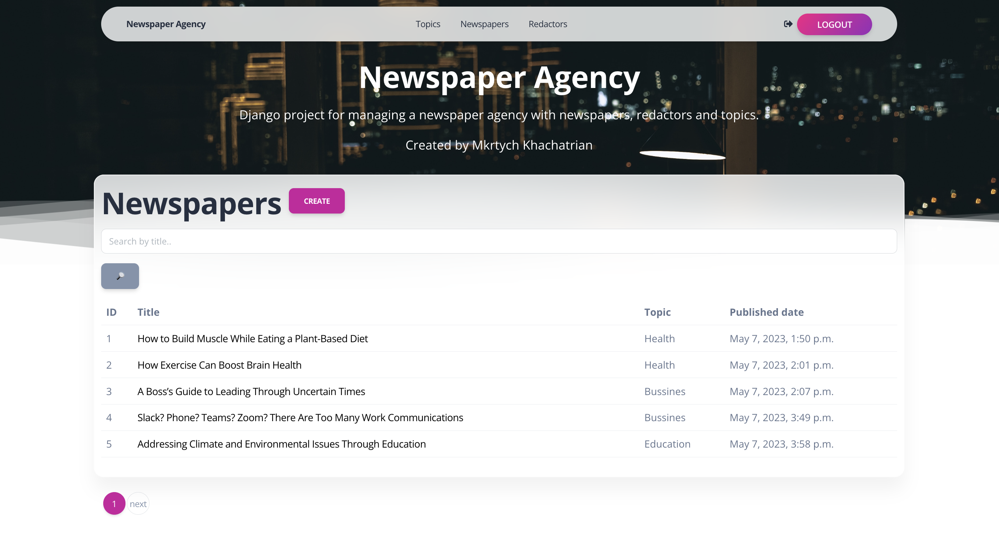

# Newspaper Agency Project

Django project for managing a newspaper agency with newspapers, redactors and topics.

## Check it out!

[Newspaper Agency Project deployed to Render](https://newspaper-agency-xfk4.onrender.com/)

## Installation

Python3 must be already installed

```shell
git clone https://github.com/MkrtychKhachatrian/newspaper-agency.git
cd newspaper-agency
python3 -m venv venv
source venv/bin/activate
pip install -r requirements.txt
python manage.py runserver # starts Django Server
```

## Features

* Autentication functionality for Redactor/User
* Managing newspapers, redactors & topics directly from website interface
* Powerful amdin panel for advanced managing

## Demo


